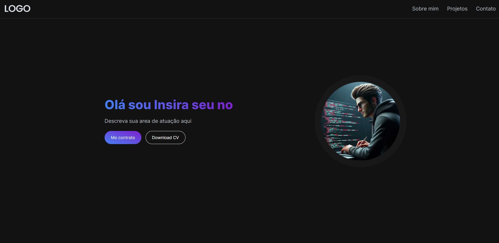

# Modelo de Portfólio para Desenvolvedores

## Características

- Desenvolvido com Next.js 14 e Tailwind CSS
- Design Moderno
- Layout de Página Única
- Totalmente Responsivo
- Otimizado

## Demo

Confira a demon em ação:

<a href="https://portfolio-model-template.vercel.app" target="_blank">
  
</a>

## Sobre o Projeto

Este modelo de portfólio foi criado com as mais recentes tecnologias web, incluindo Next.js e Tailwind CSS, proporcionando um design moderno e uma experiência de usuário atraente. Com um layout de página única, totalmente responsivo e otimizado para desempenho, este modelo é ideal para destacar suas habilidades e projetos de forma profissional.

## Instruções de Uso

1. Clone este repositório.
2. Personalize o conteúdo conforme suas informações e projetos.
3. Implemente seu portfólio na plataforma desejada.

## Como Usar

1. **Clone o Repositório e remove o repositório origem**
   ```bash
   git clone https://github.com/Felipe-Cavalari/Portfolio-model-template
   git remote remove origin
2. **Mova para seu repositório e altere o nome do projeto**
    ```bash
    cd /seu_repositorio
    mv Portfolio-model-template Nome_do_seu_Projeto
3. **Altere o nome do projeto no package.json e instale as dependencias**
    ```bash
    npm install
